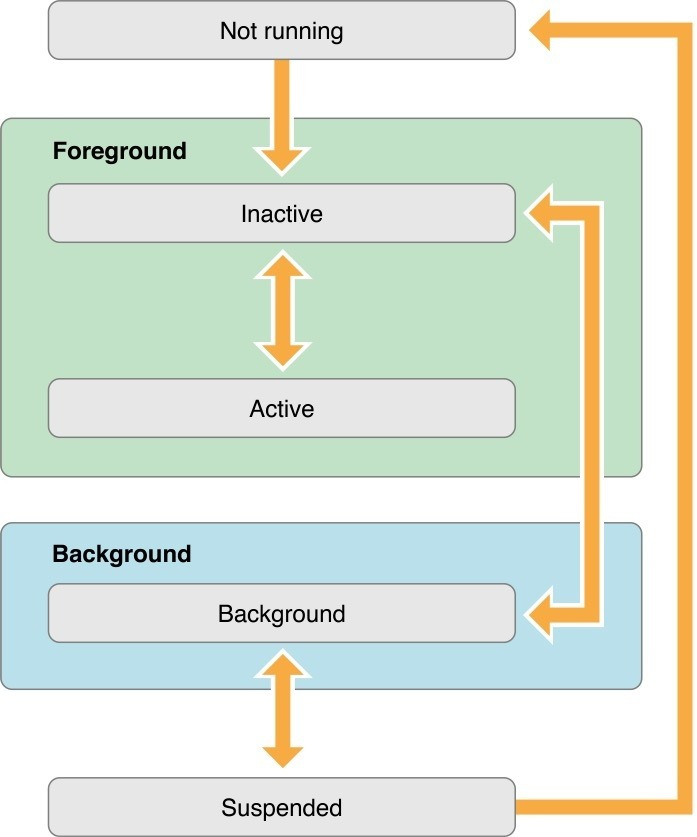
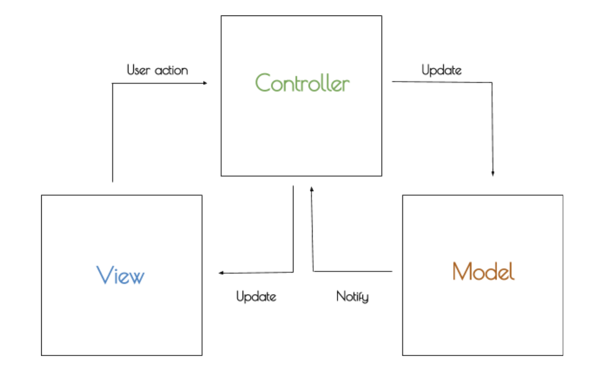

Preguntas de Prework

##Teoría:
- Investiga el ciclo de vida de una app y haz el diagrama correspondiente donde se vean todos los estados.
El ciclo de vida de la aplicación
Las aplicaciones son una sofisticada interacción entre código personalizado y los marcos del sistema. Los frameworks del sistema proporcionan la infraestructura básica que todas las aplicaciones necesitan para ejecutarse y proporcionan el código necesario para personalizar la infraestructura y darle a la aplicación la apariencia deseada. 

Los frameworks de iOS se basan en patrones de diseño como model-view-controller y delegación en su implementación. Entender estos patrones de diseño es crucial para la creación exitosa de una aplicación.

 

- Investigar la arquitectura MVC.

Es un patrón de diseño que resuelve múltiples escenarios.
 

View: Lo que verá el usuario.

Controller: Saber qué hacer con los datos que le damos al usuario y los que el usuario nos da.

Model: Datos para la ejecución del programa. (Core data). 

Interacción básica
El view y la vista se comunican con Actions y outlets. La vista avisa al controller cuando sucede alguna interacción del usuario a través de los actions. El controller tiene los outlets que funcionan mediante referencias para que suceda determinada acción en el view.

- Investiga las diferencias entre una clase y una estructura en Swift.

* Las estructuras generan automáticamente incializadores por nosotros, mientras que en las clases no lo hacen.
* Las estructuras son “value types” y las clases son “reference types”. 
* Las esstructuras no manejan herencia mientras que las clases sí soportan herencia simple.
* Los de-inicializadores son funciones que se ejecutan justo antes de que la instancia de una clase sea destruida o liberada, aunque ARC nos ayuda con las tareas de memoria, en las clases siempre es importante liberar cualquier recurso que estemos manejando. Las estructuras no soportan esto y no tiene sentido puesto que son “Value Type”.

Tipo valor significa que cuando se crea una instancia de una estructura y se asigna a otra instancia o se pasa como parámetro a una función, realmente se crea una copia, tal que, cualquier modificación no afecta la instancia original.
Tipo referencia significa que cuando creamos un objeto de una clase y se la asignamos a otra instancia o la pasamos como parámetro de una función, se pasa una referencia a la memoria de la instancia original, por lo que cualquier cambio en cualquier parte de nuestro programa afectará la instancia original.

- Investiga a qué se refiere que Swift sea un lenguaje orientado a protocolos.

La programación orientadad a protocolos (POP) es una de las técnicas de Apple.

Un protocolo, es una plantilla que usaremos cuando tenemos una especificación común, permitiendo definir cabeceras de funciones y propiedades que queremos que esa especificación común tenga.

Cuando se habla de protocolos en Swift, puede agregarse lo que se conoce como “extensiones de protocolo” que consiste en dar una implementación por defecto para una función cuya cabecera se ha definido previamente.

Estos protocolos pueden ser después conformados por clases, structs, enumerados, etc.

La idea de la POP es dejar atrás los tipos por referencia (Objetos) y centrarse en los tipos por valor (Structs, Enums), eliminando varios de los problemas que se generan al utiliar programación orientada a objetos.

##Swift:
** Los ejercicions háganlos en un Swift Playground o en http://online.swiftplayground.run/ si no tienes Mac y guarda el archivo con extensión .swift

*** Entra a https://www.hackingwithswift.com/sixty y haz los ejercicios siguientes:

Classes
Classes
Protocols and extensions
Optionals